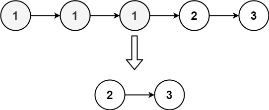

# 82. Remove Duplicates from Sorted List II `Medium`

- **Origin Link**: [https://leetcode.com/problems/remove-duplicates-from-sorted-list-ii/](https://leetcode.com/problems/remove-duplicates-from-sorted-list-ii/)
- **Tag**: `linked-list`


## Description

Given the `head` of a sorted linked list, *delete all nodes that have duplicate numbers, leaving only distinct numbers from the original list*. Return *the linked list **sorted** as well*.


## Example

**Example 1:**


```
Input: head = [1,2,3,3,4,4,5]
Output: [1,2,5]
```

**Example 2:**



```
Input: head = [1,1,1,2,3]
Output: [2,3]
```


## Constraints

- The number of nodes in the list is in the range `[0, 300]`.
- `-100 <= Node.val <= 100`
- The list is guaranteed to be **sorted** in ascending order.


## Solution Template

```java
/**
 * Definition for singly-linked list.
 * public class ListNode {
 *     int val;
 *     ListNode next;
 *     ListNode() {}
 *     ListNode(int val) { this.val = val; }
 *     ListNode(int val, ListNode next) { this.val = val; this.next = next; }
 * }
 */
class Solution {
    public ListNode deleteDuplicates(ListNode head) {
        
    }
}
```
